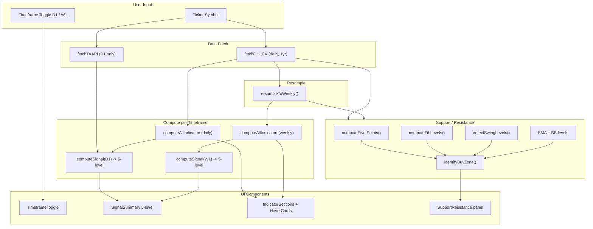

# Tech Analysis — Detailed Documentation

This document describes the technical analysis module: its data sources, indicators, signal logic, and implementation.

---

## Overview

The Tech Analysis module provides a comprehensive technical indicator dashboard for stocks across **two timeframes** (Daily and Weekly). It fetches OHLCV price data, resamples daily candles to weekly, computes 20+ indicators locally, optionally supplements with TAAPI.io values, and produces a **5-level signal score** (0-100) with educational hover cards on every indicator plus **support/resistance zones** with buy-zone detection.

**Entry point:** `src/tech-analysis/index.tsx`
**Primary logic:** `src/tech-analysis/calculations.ts`
**Support/Resistance:** `src/tech-analysis/support-resistance.ts`
**Hover descriptions:** `src/tech-analysis/hover-descriptions.ts`

---

## Data Flow

---

## Dual Timeframe (D1 + W1)

- **Daily candles**: Fetched from OHLCV sources (1 year, ~252 candles)
- **Weekly candles**: Resampled from daily candles by grouping by ISO week. Open = first day's open, High = max highs, Low = min lows, Close = last day's close, Volume = sum. Yields ~52 weekly candles.
- All indicators computed independently for each timeframe (weekly SMA 200 skipped due to insufficient data)
- TAAPI remains D1-only (free tier rate limit: 1 req/15s)
- Both timeframe signals shown in summary, user toggles between D1/W1 for indicator details

---

## OHLCV Data Sources

The module fetches daily candles with a fallback chain. The first source that returns at least 20 candles is used.

| Priority | Provider | Endpoint | Notes |
|----------|----------|----------|-------|
| 1 | Finnhub | `/stock/candle` | 1 year of daily data |
| 2 | Polygon | `/v2/aggs/ticker/{sym}/range/1/day` | 365 days, adjusted |
| 3 | Twelve Data | `/time_series` | 252 days |
| 4 | Alpha Vantage | `TIME_SERIES_DAILY` | compact output |

All requests are proxied via `proxyFetch` (Netlify serverless). Data is cached in `localStorage` under `tech_{SYM}_v2` for 24 hours.

---

## TAAPI.io Supplement

TAAPI.io is called in parallel with the OHLCV fetch via its bulk API (`POST /bulk`). It provides:

- **RSI** (default 14)
- **MACD** (value + signal)
- **Bollinger Bands** (upper, mid, lower)
- **EMA 20** and **EMA 50**

If TAAPI returns valid data, its RSI and MACD values override the locally computed ones for the signal score and indicator cards. The TAAPI snapshot is optional; the module works fully without it.

---

## Indicators

### Oscillators

| Indicator | Parameters | Interpretation |
|-----------|------------|----------------|
| **RSI (14)** | Period 14 | 0-100. >=70 overbought, <=30 oversold. 50-70 bullish, 30-50 bearish. |
| **Stochastic %K** | 14, 3 | 0-100. >=80 overbought, <=20 oversold. %K > %D = mild bullish. |
| **Williams %R** | 14 | -100 to 0. >=-20 overbought, <=-80 oversold. |
| **CCI (20)** | Period 20 | >100 overbought, <-100 oversold. >0 bullish, <0 bearish. |
| **MFI (14)** | Period 14, volume-weighted | 0-100. >=80 overbought, <=20 oversold. Like RSI but with volume. |
| **Stochastic RSI** | RSI 14, Stoch 14 | 0-100. >=80 overbought, <=20 oversold. More sensitive than Stochastic. |

### Trend

| Indicator | Parameters | Interpretation |
|-----------|------------|----------------|
| **MACD** | 12, 26, 9 | Bullish when MACD > Signal. Crossover used for signal score. |
| **ADX (14)** | Period 14 | <20 no trend, 20-40 moderate, >40 strong. Not directional. |
| **Parabolic SAR** | Step 0.02, Max 0.2 | Below price = bullish. Above = bearish. Acts as trailing stop. |
| **EMA 9 / 21** | — | EMA 9 > EMA 21 = bullish crossover. Short-term trend direction. |
| **SMA 20 / 50 / 200** | — | Price above = bullish, below = bearish. Dynamic S/R levels. |
| **Price % vs SMA** | — | Distance from each moving average in %. |

### Volatility

| Indicator | Parameters | Interpretation |
|-----------|------------|----------------|
| **Bollinger %B** | 20, 2 | >1 above upper band, <0 below lower. 0.5 = middle. |
| **Bollinger Width** | 20, 2 | Squeeze (<3%); wide when high (>12%). |
| **ATR (14)** | Period 14 | Average daily range. Used for stops and volatility context. |

### Momentum & Context

| Indicator | Parameters | Interpretation |
|-----------|------------|----------------|
| **ROC 10-day** | 10 | Short-term momentum. |
| **ROC 20-day** | 20 | ~1-month momentum. |
| **OBV Direction** | 20-day lookback | Rising/Falling/Flat. Confirms volume trend. |
| **Volume Ratio** | — | >1 above average, >2 very high. |
| **52-week position** | — | 0-100% of yearly range. |

---

## Signal Score (5-Level, 0-100)

A weighted composite from continuous sub-scores (not binary votes). Each indicator contributes a 0-100 sub-score based on its value, weighted by importance:

| Category | Weight | Indicators |
|----------|--------|------------|
| Trend | 35% | MACD, SMA 50, SMA 200, ADX+PSAR, EMA 9/21 |
| Oscillators | 30% | RSI, Stochastic, CCI, MFI, StochRSI |
| Momentum | 20% | ROC 10, ROC 20, OBV direction |
| Volatility | 15% | BB position, volume ratio |

**Labels:**
- **Strong Bullish:** score >= 75
- **Bullish:** score 55-74
- **Neutral:** score 40-54
- **Bearish:** score 25-39
- **Strong Bearish:** score < 25

---

## Support & Resistance

Computed from multiple sources in `support-resistance.ts`:

| Source | Levels |
|--------|--------|
| Classic Pivot Points | PP, S1/S2/S3, R1/R2/R3 (daily + weekly) |
| Fibonacci Retracement | 0%, 23.6%, 38.2%, 50%, 61.8%, 78.6%, 100% from 52-week range |
| Swing Highs/Lows | Detected from recent 60 candles (daily) and weekly candles |
| SMA levels | SMA 20, 50, 200 as dynamic S/R |
| Bollinger Bands | Upper, mid, lower bands |

### Buy Zone Detection

1. Collect all support levels below current price (within 20% range)
2. Cluster nearby levels within 2% of each other
3. Rank by confluence count (number of overlapping indicators)
4. Strongest cluster = primary buy zone
5. Strength rated: strong (4+), moderate (2-3), weak (1)

---

## Hover Cards (Educational Tooltips)

Every indicator card includes a hover info icon that shows a 3-section tooltip:

1. **"What is this?"** — 1-2 sentence explanation for zero-knowledge audiences
2. **"Current Reading"** — What the specific current value means in plain English
3. **"How to Use It"** — Simple interpretation rules

Static descriptions defined in `hover-descriptions.ts`. Rendered by `IndicatorHoverCard.tsx` (CSS-only popover, auto-positioning, mobile tap support).

---

## Indicator Cards & Narratives

Each indicator is shown as a card with:
- **Name** with info hover icon
- **Value** (e.g. 62.3)
- **Label** (e.g. Mild Bullish, Overbought)
- **Description** — plain-English explanation of the reading
- **HoverInfo** — educational 3-section tooltip

Cards are grouped into four sections:
1. **Oscillators** — RSI, Stochastic, Williams %R, CCI, MFI, Stochastic RSI
2. **Trend** — MACD, ADX, Parabolic SAR, EMA 9/21, Price vs SMA 20/50/200
3. **Volatility** — Bollinger %B, BB Width, ATR
4. **Momentum & Context** — ROC 10/20, OBV Direction, Volume Ratio, 52-week Position

---

## Caching

- **Key:** `tech_{SYM}_v2` (e.g. `tech_AAPL_v2`)
- **TTL:** 24 hours
- **Contents:** `{ ts, data: { dailyIndicators, dailySignal, weeklyIndicators, weeklySignal, sr, displayName, snap } }`
- **Storage:** `localStorage` via `safeSetItem` (evicts on `QuotaExceededError`)

---

## Component Structure

| Component | File | Role |
|-----------|------|------|
| TechAnalysis | `index.tsx` | Main container, orchestrates search and display |
| SearchForm | `components/SearchForm.tsx` | Ticker input and submit |
| TickerHeader | `components/TickerHeader.tsx` | Ticker, price, YTD change |
| SignalSummary | `components/SignalSummary.tsx` | Dual-timeframe 5-level signal badges + detail pills |
| TimeframeToggle | `components/TimeframeToggle.tsx` | D1/W1 tab switcher |
| IndicatorSections | `components/IndicatorSections.tsx` | Renders indicator cards by section with hover cards |
| IndicatorHoverCard | `components/IndicatorHoverCard.tsx` | Educational hover tooltip (3 sections) |
| SupportResistance | `components/SupportResistance.tsx` | S/R visualization + buy zone callout |
| LoadingState | `components/LoadingState.tsx` | Loading UI |
| ErrorState | `components/ErrorState.tsx` | Error UI with clear-cache option |
| LandingHint | `components/LandingHint.tsx` | Empty state before search |

---

## Key Files

| File | Purpose |
|------|---------|
| `calculations.ts` | `computeAllIndicators`, `computeSignal`, `buildIndicatorCards`, `fetchOHLCV`, `fetchTAAPI`, `resampleToWeekly`, indicator math (RSI, MACD, BB, ADX, MFI, PSAR, StochRSI, OBV, etc.) |
| `types.ts` | `Candle`, `IndicatorResult`, `TaapiSnap`, `Signal`, `SignalLabel`, `IndicatorCard`, `HoverInfo`, `TimeframeData`, `Timeframe`, S/R types |
| `support-resistance.ts` | `computePivotPoints`, `computeFibLevels`, `detectSwingLevels`, `identifyBuyZone`, `computeSupportResistance` |
| `hover-descriptions.ts` | Static plain-English descriptions for all indicators |
| `hooks/useTechData.ts` | Search, fetch, cache, dual-timeframe state management |
| `utils/storage.ts` | `safeSetItem`, `clearCache` |
| `utils/formatters.ts` | `badgeCls`, `cardBorder`, `valueColor`, `signalColor`, `signalBarGradient` |

---

## Dependencies

- **OHLCV:** Finnhub, Polygon, Twelve Data, or Alpha Vantage (via proxy)
- **TAAPI.io:** Bulk API for RSI, MACD, Bollinger Bands, EMA 20/50 (D1 only)
- **No chart library** — indicator cards, signal badges, and S/R visualization only
- **lucide-react** — icons (Info, Target, TrendingUp, etc.)
